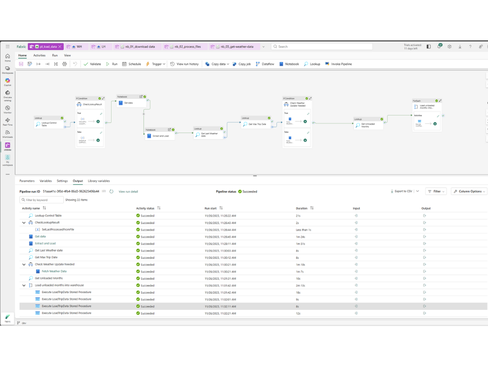

# Citibike Analytics Pipeline

An end-to-end data engineering solution using Microsoft Fabric to process 800,000+ bike trips with integrated weather data, featuring medallion architecture and a star schema optimized for Power BI analytics.

## Architecture

```
┌─────────────────────────────────────────────────────────────────────────────┐
│                              DATA SOURCES                                   │
├─────────────────────────────────────────────────────────────────────────────┤
│  S3 Bucket (Citibike Trip Data)          OpenMeteo API (Weather Data)       │
└─────────────────────┬───────────────────────────────┬───────────────────────┘
                      │                               │
                      ▼                               ▼
┌─────────────────────────────────────────────────────────────────────────────┐
│                         BRONZE LAYER (Lakehouse)                            │
├─────────────────────────────────────────────────────────────────────────────┤
│  citibike_trips (raw)                    weather_data (raw)                 │
│  download_control                        weather_control                    │
│  file_processing_history                 citibike_metadata                  │
└─────────────────────┬───────────────────────────────┬───────────────────────┘
                      │                               │
                      │         (Views)               │
                      ▼                               ▼
┌─────────────────────────────────────────────────────────────────────────────┐
│                         SILVER LAYER (Warehouse)                            │
├─────────────────────────────────────────────────────────────────────────────┤
│  staging_citibiketrips (view)            staging_weatherdata (view)         │
└─────────────────────┬───────────────────────────────┬───────────────────────┘
                      │                               │
                      │    (Stored Procedure)         │
                      ▼                               ▼
┌─────────────────────────────────────────────────────────────────────────────┐
│                          GOLD LAYER (Warehouse)                             │
├─────────────────────────────────────────────────────────────────────────────┤
│  dim_date    dim_time    dim_station    dim_bike    dim_member   dim_weather│
│                                                                             │
│                              fct_trips                                      │
│         (with calculated metrics: duration, distance, speed)                │
└─────────────────────────────────────────────────────────────────────────────┘
                      │
                      ▼
┌─────────────────────────────────────────────────────────────────────────────┐
│                              POWER BI                                       │
└─────────────────────────────────────────────────────────────────────────────┘
```

## Features

- **Automated Ingestion**: Fetches trip data from public S3 buckets with checkpoint tracking
- **Incremental Loading**: Processes only new/unloaded months automatically
- **Weather Enrichment**: Integrates hourly weather data via OpenMeteo API
- **Self-Healing Pipelines**: Comprehensive metadata tracking and control tables
- **Star Schema**: Dimensional model optimized for analytical queries
- **Calculated Metrics**: Trip duration, distance (Haversine formula), and speed

## Tech Stack

| Component | Technology |
|-----------|------------|
| Orchestration | Microsoft Fabric Data Factory |
| Data Lake | Microsoft Fabric Lakehouse (Delta Lake) |
| Data Warehouse | Microsoft Fabric Warehouse |
| Processing | PySpark, T-SQL Stored Procedures |
| Visualization | Power BI |

## Pipeline Structure

### Notebooks (Lakehouse)

| Notebook | Purpose |
|----------|---------|
| `nb_01_download_data` | Fetches trip data from S3 with checkpoint control |
| `nb_02_process_files` | Extracts CSVs and loads to Delta tables |
| `nb_03_get_weather_data` | Fetches weather data from OpenMeteo API |

### Data Factory Pipeline


## Data Model

### Fact Table

**fct_trips**: Core trip records with foreign keys to dimensions and calculated metrics

| Metric | Calculation |
|--------|-------------|
| TripDurationMinutes | DATEDIFF between start and end time |
| TripDistanceKm | Haversine formula using lat/long coordinates |
| SpeedKmh | Distance / Duration |

### Dimension Tables

| Table | Description |
|-------|-------------|
| dim_date | Date attributes (year, quarter, month, day, season, weekend flag) |
| dim_time | Hour-level attributes (time of day, business hours, peak hours) |
| dim_station | Station details (name, coordinates, area) |
| dim_bike | Bike types (classic, electric) |
| dim_member | Membership types (member, casual) |
| dim_weather | Hourly weather conditions (temperature, humidity, precipitation) |

## Setup

1. Create a Microsoft Fabric workspace
2. Create a Lakehouse and Warehouse
3. Deploy notebooks to the Lakehouse
4. Create staging views in Warehouse pointing to Lakehouse tables
5. Deploy the stored procedure (`LoadTripData`)
6. Configure the Data Factory pipeline
7. Run the pipeline

## Data Sources

- **Trip Data**: [Citibike System Data](https://s3.amazonaws.com/tripdata) (Jersey City subset)
- **Weather Data**: [Open-Meteo Historical Weather API](https://open-meteo.com/)

## Skills Demonstrated

- Microsoft Fabric (Data Factory, Lakehouse, Warehouse)
- Delta Lake / Medallion Architecture
- PySpark & T-SQL
- Dimensional Modeling
- REST API Integration
- Incremental Loading Patterns
- Pipeline Orchestration
